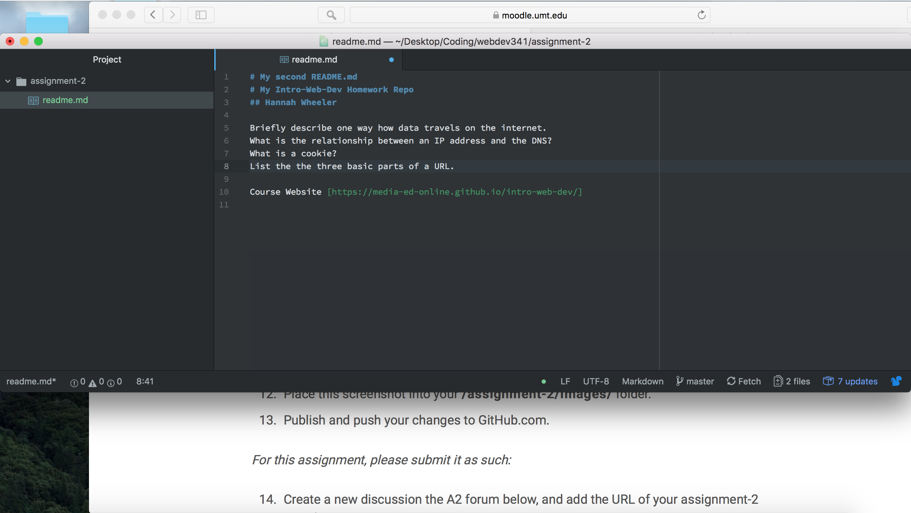

# My Second README.md
## Hannah Wheeler
1.) Version Control allows you to work on the same file with many people. It can also allow you to manage the changes to your system so you can always go back and save you progress so you have some backups of the files while everyone is making changes.

2.) [Responses](./responses.txt)

3.) My work cycle is that I read through the videos and text then I get started. I will google or youtube anything that I do not understand or cant figure out by trial and error. Then if I really can't figure out how to do something I will go look at what other students have done and see what I am missing, didn't undestand, or could have done better. Then after I have done that I will google why what they did makes sense or works better, then go from there.

 
