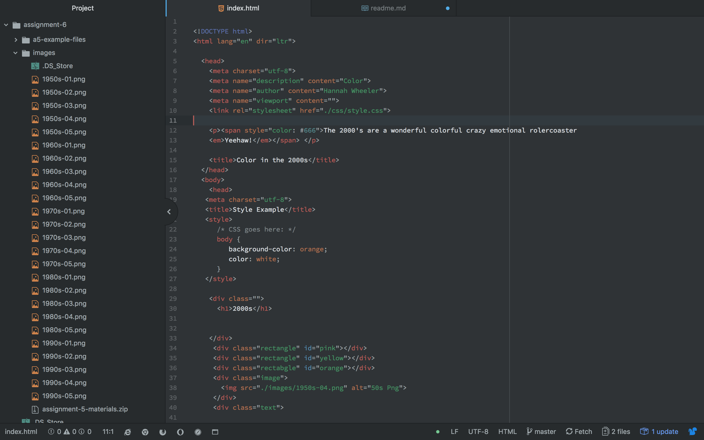

# README.md
## Hannah Wheeler

B.) I chose the really cool star mostly because i liked it a lot. I also chose the cheeta print because I really liked that as well. I then incormporated the ed sheeran video because ed sheran I truly beleive represents the 2000s like no one else.

C.) The color pallet I chose was meant to reflect the craziness of the 2000s. I feel like the 2000s have been weird and awkward so I wanted eveerything on the website to show that.

D.) My work was obviously straight forward. I chose to position eveeryhting within my website very awkwardly and very basic to resemble the awkward basicness of my generation.

E.) 
