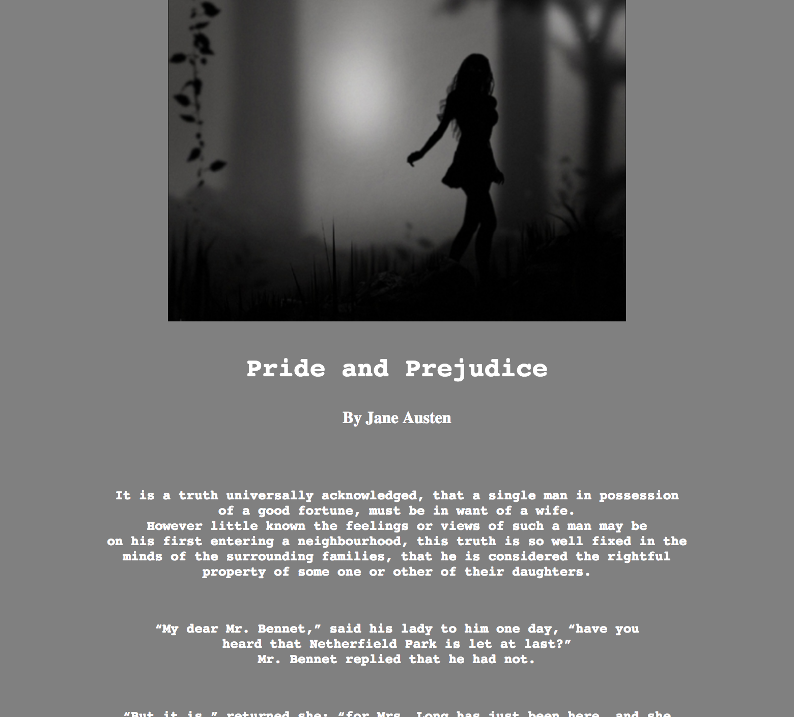

# README.md
## Hannah Wheeler

1. I chose Cinzel font because I liked the way it looked. I feel like it gave the page the innocent but refined look I was going for.

2. A system font is a file stored directly on a computer that makes a font available in most applications on a computer. It has to be downloaded and installed before it can be used.

A web-font is a font that is stored in a server and can be displayed on a web page through connection with the file over the internet. It is not always available due to a browser being old or being unable to download the file. Hence why web-safe fonts are available, they're universal fonts that every computer has so it's easy for them to display on every computer.

 
Fallback fonts help with issues of web against web safe fonts. A fallback font replaces a less common font with one that is similar and universal.

3. This assignment wasn't very difficult besides getting the stupid font to work. I did a lot of looking at other students work and the example to figure out where I went wrong. I dont think I fixed it so woops. However i did get the structure and flow that I wanted for this book:)

