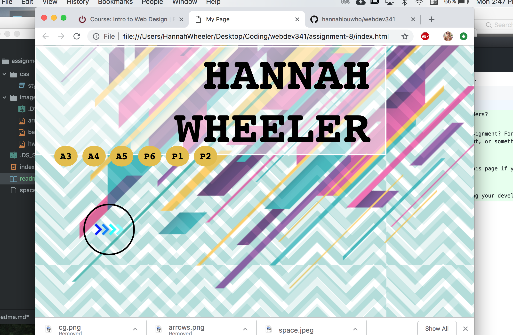

# README.md
## Hannah Wheeler

B.) Padding is the invisible edges around an object that keep it from interacting with other objects or colliding with them.

Margins are the area around the specific image or thing that determine where it will go and how far.

Lastly Borders are similar to margins but they protect something from disapearing of a page.

the hardest part of the assignment was linking my past assignments to the page. They all go back to github not to my live pages. super annoying. also couldnt get the arrow link to where I wanted that to be...... totally screwed my flow.

D.) My work cycle was a lot of copying and pasting and then just messing around with the page to make it flow and look pretty. I really liked some of the asspects of the page we could use as a resource. I tweaked the arrows image or made the boarders and positioning different so it wasnt the exact same of course. I also incorporated some really cool layer work that was a lot of fun to play with. I used a lot of my resources and went from there to create my own page. 

E.) 

