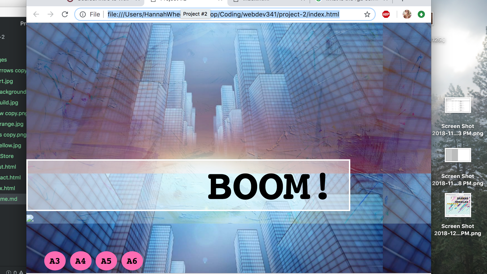

# README.md
## Hannah Wheeler

B.) Learning HTML has been a lot of fun and a lot of hating myself because I misplaced a word or a letter or something. But overall this is prett neat!

C.) I really like styling I think it is so cool what we can do with coding and what all we can create. I am excited to play with color

D.) I basically had 30 min to finish this assignment and i feel like I just threw together what I knew and had from other assignments and I am not sure if I met all the criteria.... hopefully I got close!!

E.) 

